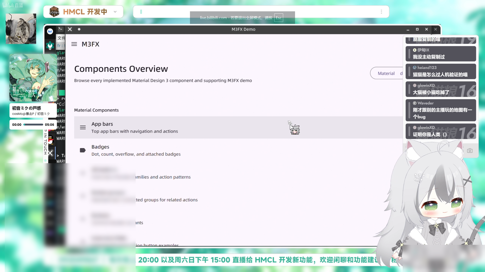

# 📖 简介

经常看 **“我的世界”**、**“APEX英雄”** 等分区的大伙一定有被**高斯模糊遮罩**烦到吧？

网游还好说，但MC是单机游戏，一般都是私服直播，都是熟人，还**强制遮挡**，这是不是有那么**亿点点**离谱了？看基岩版的直播更是能被遮罩的位置气笑

> *展示直播间：@Glavo（HMCL开发者）*

## ⚛️ 主要功能

本脚本可以让你**完全感受不到遮罩的存在**，再也不会闪现到你的屏幕上了！

为此，我们做出了一个违反祖宗的决定！**先斩，后奏！**

先全局添加隐藏遮罩的样式，等页面加载一段时间后，再判断遮罩是否存在。如果不存在，再清理提前添加的样式，保证了页面底层的干净

## ⚙️ 安装方法

- 你可以在 [GreasyFork (油叉)](https://greasyfork.org/zh-CN) 上搜索到[本同名项目](https://greasyfork.org/zh-CN/scripts/588112-bilibili%E7%9B%B4%E6%92%AD%E9%97%B4-%E6%97%A0%E6%84%9F%E5%8E%BB%E9%99%A4%E9%AB%98%E6%96%AF%E6%A8%A1%E7%B3%8A%E9%81%AE%E7%BD%A9)，并直接安装，并且后续能自动更新。这是最便捷的方法
- 你也可以手动下载仓库中的.js文件，并拖动到油猴界面手动安装

## 🛠️ 有关后续维护

> 失效概率：低

后续如果失效（报违规操作），多半是玩猫鼠游戏，墙高一尺，道高一丈

如果发现失效，欢迎提交issue ¯\\_(ツ)_/¯

## 📃 开发报告

B站对于某些特定元素有一套“违规操作”判断逻辑，目前只判断以下样式，并且只会在元素加载后延迟500ms检测一次

> `if (null != t && ("none" === getComputedStyle(t).display || "hidden" === getComputedStyle(t).visibility)){...}`

所以如果用常规方法隐藏遮罩元素，就会触发`90005`违规代码，并切断直播连接

而我们用了“偷鸡方法”，只要绕过就行。具体操作就自行看脚本代码吧

## 📜 协议&许可证

> 本仓库所有**代码**采用 GPL-3.0 协议进行开源

## 参考和鸣谢

- [Bilibili 20-21年旧版](https://greasyfork.org/zh-CN/scripts/474444-bilibili-20-21%E5%B9%B4%E6%97%A7%E7%89%88)